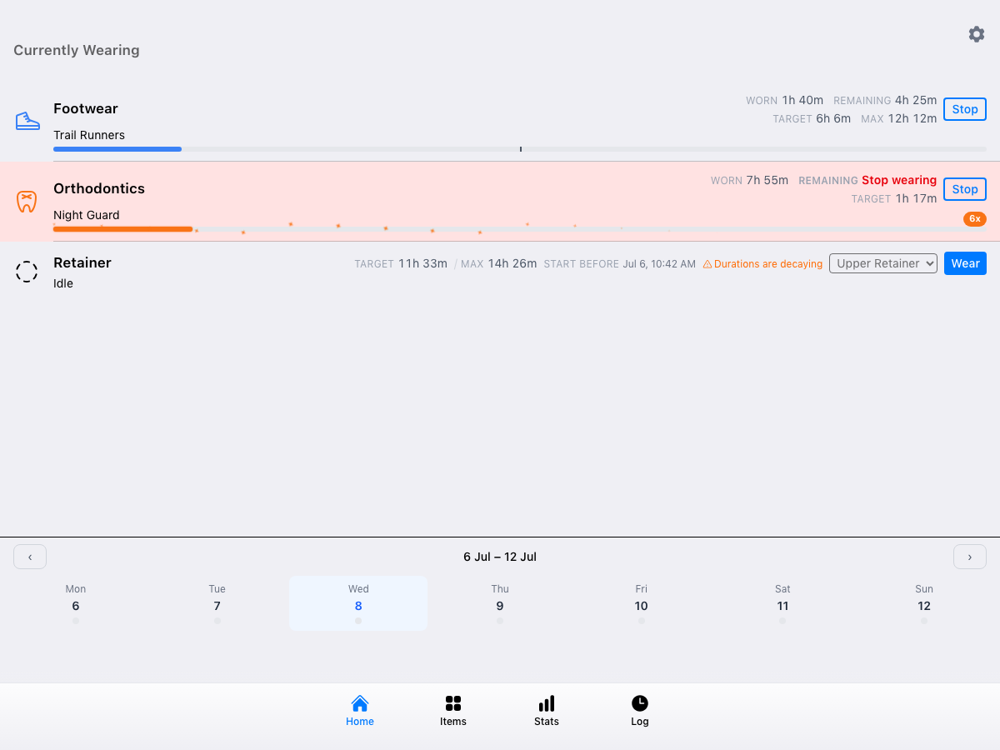
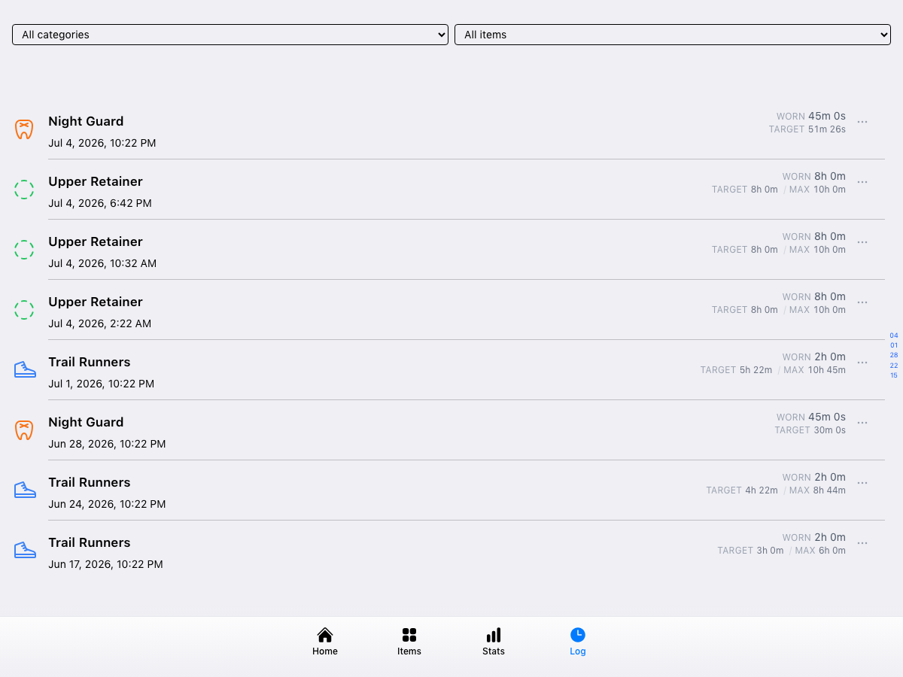
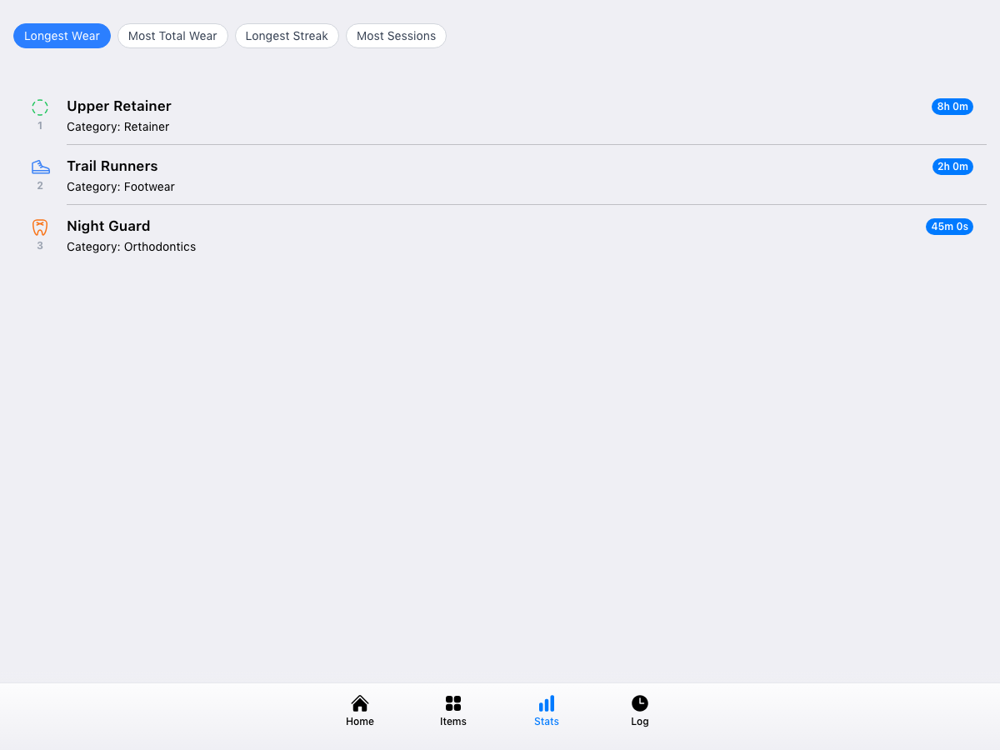

# Weartrack

Track the usage of wearable items — orthotics, braces, retainers, shoes, anything worn on a schedule. Log sessions, view wear history on a calendar, and see leaderboards across items and categories.

> [!WARNING]
> **This app has no authentication.** It is single-user by design and
> assumes the network layer keeps it private. Only run it:
> - on `localhost` / a private LAN, or
> - behind an authenticating reverse proxy (e.g. [Authelia](https://www.authelia.com), [Authentik](https://goauthentik.io), Tailscale Serve with access control, etc.)
>
> Anyone who can reach the app's HTTP port can read and edit all data. Do
> not expose it directly to the internet.

## What it does

- **Wear sessions** — start and stop a timer for any item; sessions are stored with precise durations.
- **Target & max wear durations** — each category has a target and (optionally) a maximum wear duration per session. Both grow session-over-session as you keep wearing on schedule, and decay back toward their starting values if you go too long without wearing.
- **Lap counter** — categories with no maximum don't cap out at target: the session bar wraps every time elapsed crosses it ("laps"), escalating through visual tiers (a soft glow, then increasingly dense sparkles) the longer a session runs.
- **Rest & decay tracking** — each category enforces a minimum rest period after a session ends. The Home screen shows a live rest countdown while you're within that window, and a decay countdown afterward if you wait long enough for targets to start shrinking back down.
- **Category streaks** — a flame badge on each category shows your current consecutive-use streak.
- **Calendar / Log** — week-by-week and list views of wear history, with jump-to-date navigation.
- **Leaderboards** — rank items by total wear, session count, longest single session, or streak.
- **Injury logging** — record overuse events; an active injury halves target/max durations for that category until resolved.
- **PWA** — installable on mobile, works offline once loaded.

## Screenshots

| Home | Log | Stats |
|------|-----|-------|
|  |  |  |

## Architecture

```
src/
  backend/   Hono API server + SQLite via better-sqlite3
  frontend/  Vue 3 + Vite PWA + Konsta UI (iOS-style components)
```

The backend exposes a JSON REST API under `/api/`. In production, both are served from the same Docker container (backend on port 3000). In development they run separately, with Vite proxying `/api` calls to the backend.

## Development

Prerequisites: Node.js 22+

```bash
# Install dependencies
npm ci --prefix src/backend
npm ci --prefix src/frontend --legacy-peer-deps

# Run backend (port 3000) and frontend (port 5173) in separate terminals:
npm run dev --prefix src/backend
npm run dev --prefix src/frontend
```

The frontend dev server proxies `/api/*` to `http://localhost:3000`, so you can hit `http://localhost:5173` and have everything work.

## Production

Build and run with Docker Compose:

```bash
docker compose up --build
```

The app will be available at `http://localhost:3000`.

## Tech stack

- **Backend:** [Hono](https://hono.dev) · [better-sqlite3](https://github.com/WiseLibs/better-sqlite3) · Node.js
- **Frontend:** [Vue 3](https://vuejs.org) · [Vite](https://vitejs.dev) · [Konsta UI](https://konstaui.com) · [Tailwind CSS](https://tailwindcss.com) · [Heroicons](https://heroicons.com)
- **CI/CD:** GitHub Actions · Docker
